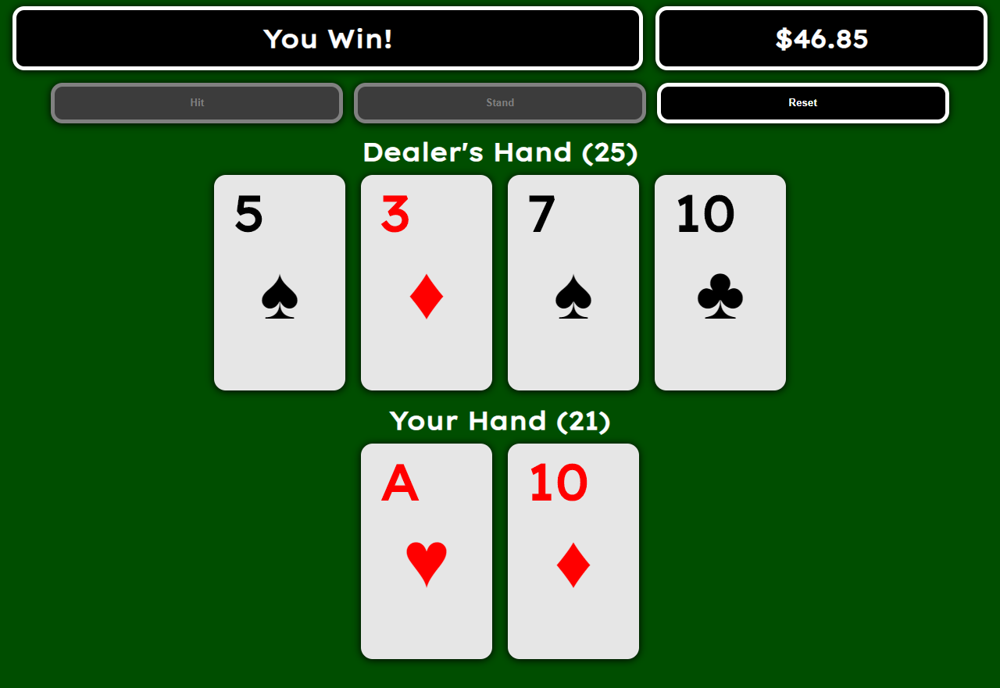

# Blackjack React App
Blackjack card game built in React, using TypeScript.
## What I Learned:
- Using TypeScript with React
- Working with and manipulating React array hooks
- Implementing Typescript enums
## GitHub Pages:
### Link:
https://jarodburchill.github.io/blackjack-react-app
### Preview:

## Installation: 
```
git clone https://github.com/jarodburchill/blackjack-react-app
cd blackjack-react-app
npm install
npm start
```
